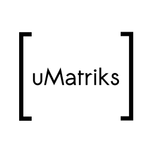

# uMatriks
uMatriks is a Matrix protocol client for Ubuntu Touch.

To have more information or to talk about this app, join the room:
`#uMatriks:matrix.org`

To know more about Matrix go to https://matrix.org/

## Translate
Deleted! Will be recreated soon...

## Thanks

The application makes use of the [libqmatrixclient](https://matrix.org/docs/projects/sdk/libqmatrixclient.html "libqmatrixclient") developed by Felix Rohrbach kde@fxrh.de and others. The source code can be found in https://github.com/QMatrixClient/libqmatrixclient

`#quaternion:matrix.org`

This application also takes important parts of the code base of [Tensor](https://matrix.org/docs/projects/client/tensor.html "Tensor") by David A. Roberts, Roman Plášil and others. The source code of tensor can be found in https://github.com/davidar/tensor

`#tensor:matrix.org`

## Pre-requisites
Ubunu-SDK or clickable (see app development section to build the app without sdk or clickable).

## Building
Compile using the sdk and then create a .click file.

### Clickable
We can use [clickable](https://docs.ubports.com/en/latest/appdev/index.html#clickable 'clickable') to build and create a click file.

    $ clickable build
    $ clickable click-build
    
This will create a build folder and the click file will be there.

## Installation
There are different ways to install this app in a phone.

- Use the Ubuntu-SDK to install the created click package.
- Send to yourself the click package over wire, or over telegram, and open the file with the OpenStore app.

### Clickable
Once the click file has been created with clickable, the app installation can be made with the following command.

    $ clickable install

## App development
This is the initial release of the uMatriks app. There are several things to improve, both in the usability as in the features side.

In this moment, you can not create a new user within the app. In order to do so, go to https://riot.im/app .

### Build without SDK
This explains how to compile && build the app without the the SDK.

    $ sudo apt-get install git-core click qmake
    $ git submodule update --init
    $ qmake
    $ make
    $ qmlscene -I lib/ Main.qml
    $ click build .

Local non root install:

    $ INSTALL_ROOT=$PWD/package_root make install
    $ cd package_root
    $ qmlscene -I lib/x86_64-linux-gnu/ uMatriks/Main.qml

### Plain docker

Build docker image

    $ docker build -t ubports_xenial .

Build code

    $ docker run -ti --rm -e DISPLAY=:0 -v /tmp/.X11-unix:/tmp/.X11-unix -v `pwd`:/home/developer/ubports_build ubports_xenial bash -c "qmake && make"

Run code

    $ docker run -ti --rm -e DISPLAY=:0 -v /tmp/.X11-unix:/tmp/.X11-unix -v `pwd`:/home/developer/ubports_build ubports_xenial bash -c "/usr/bin/qmlscene -I lib/ uMatriks/Main.qml"

Run tests

    $ docker run -ti --rm -e DISPLAY=:0 -v /tmp/.X11-unix:/tmp/.X11-unix -v `pwd`:/home/developer/ubports_build ubports_xenial bash -c "qmake && make check"
